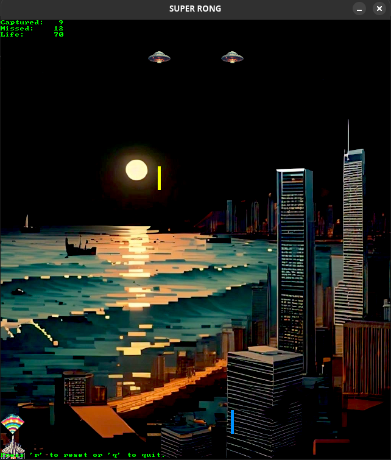

# Super Rong

This project was a way for me to learn SDL 3. 

The game is conceptualy a "Reverse Galaga" in that the point of play is to catch all the lasers from the attacking ships via your force field. Each missed laser decreases your life while each captured laser increases it. The other ships begin to fire after different milestones, and the game speeds up as you progress. If you miss enough lasers, you get a game over. 

## Input
You control the ship via the arrow keys on the keyboard, and the screen wraps on the horizontal axis. 
- 'S' - Starts the game
- 'R' - Restarts a game in progress
- 'Q' - Quits the game

## Compilation
This game should compile on Linux or Windows assuming the SDL 3 libraries are installed. In the case of Linux:

```make```

For Windows, a Solution File is included for compilation with Visual Studio. 

## Screenshot


